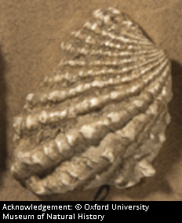
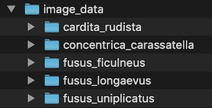
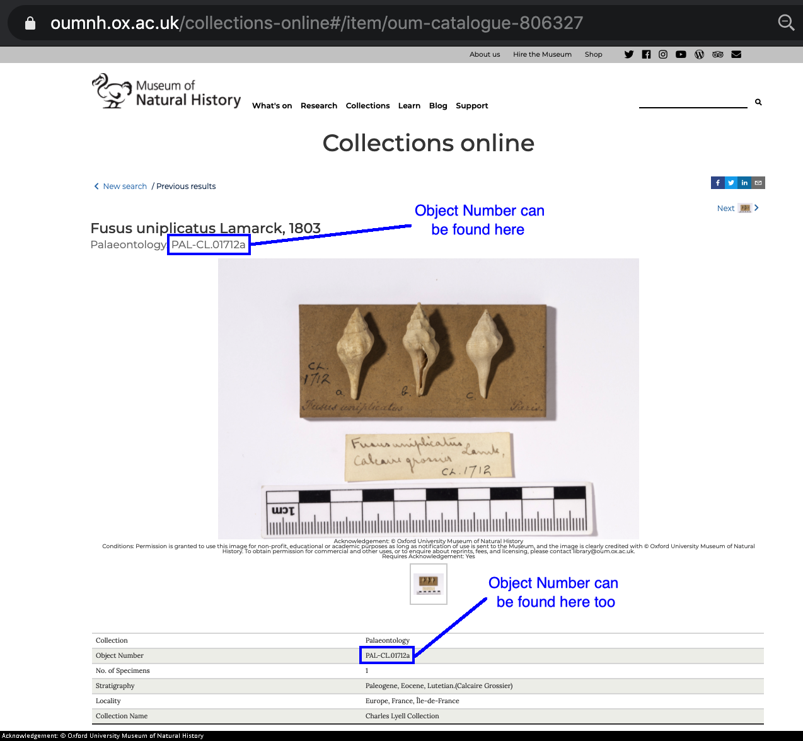
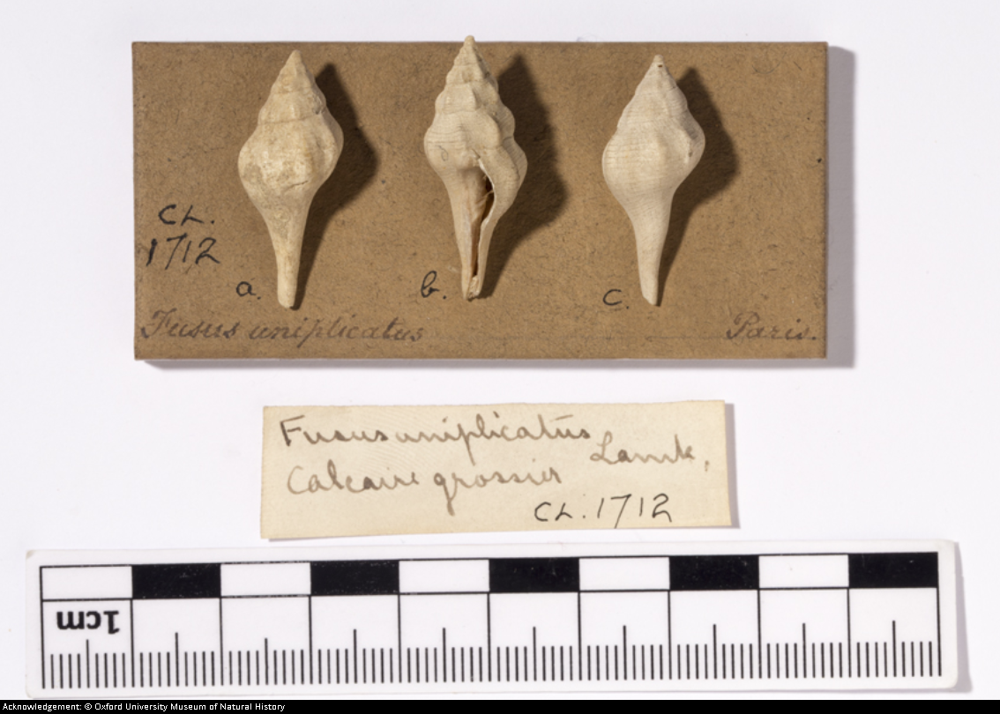
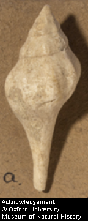
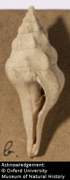
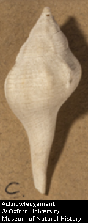
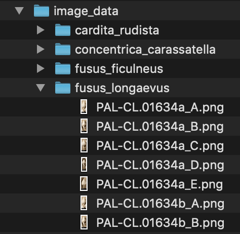
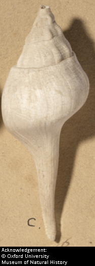

## Fossil Image Recognition

### Welcome to the Project!
This project builds and uses a Convolutional Neural Network (CNN) to predict the scientific names of given fossil images.

### Features
The project has two main scripts:

1. **Build_Model.ipynb**: Creates and trains a CNN using a collection of images of fossils that have been labeled with their scientific name.
2. **Make_Predictions.ipynb**: The CNN will take, as input, a picture of a new fossil and give, as output, an identification of the fossil (i.e., the fossil's scientific name).

### Copyright Acknowledgement

#### Image source
The images of fossils were collected from the very excellent online palaeontology collection of the [Oxford University Museum of Natural History](https://oumnh.ox.ac.uk/collections-online#/search).  

The museum provides clear conditions for [online image use and copyright terms](https://oumnh.ox.ac.uk/collections-online-image-use-and-copyright-terms) and written permission was obtained for the use of their images in this project.

#### Implementation of copyright conditions
One condition of that permission is that every image displayed in this project must be labeled with an appropriate copyright acknowledge statement.

For images from [Oxford University Museum of Natural History](https://oumnh.ox.ac.uk/collections-online#/search), that copyright statement is:

<small>**Acknowledgement: &copy; Oxford University Museum of Natural History**</small>

For images from the [GB3D Type Fossils Project](http://www.3d-fossils.ac.uk/home.html) that copyright acknowledgement statement is:

<small>**Acknowledgement: &copy; Oxford University Museum of Natural History / www.3d-fossils.ac.uk / CC BY-NC-SA**</small>

This copyright statement is added as a physical part of each image used from the Oxford University Museum of Natural History.  Specifically, our copyright assurance procedure works like this:

(1) a picture of the copyright text is generated by a utility script (.src/utilities/Add_oxford_copyright_to_images.ipynb) in the appropriate size.


(2) the generated picture of the copyright text is concatenated to the original image 

(3) to form a new picture which includes both images.  For example:



This new picture, with the copyright acknowledgement "baked in", is the only image stored in or used by the project.  Thus, the copyright will be shown whenever the image is viewed and it will be carried along if any of the images or the project is copied by anyone.  Note: The preservation of these copyright statements is a condition of the license to use this project.

### Data Organization
To organize the image files, this project's "image_data" directory is divided into sub-directories that are each named after the scientific name of the specimens whose images they contain (e.g., all pictures of Fusus Longaevus are in a sub-folder named fusus_longaevus inside the image_data directory).  Thus, the image_data subfolders end up looking like:




To further organize the image data, the file names for each specimen match the Object Number used by the [Oxford University Museum of Natural History](https://www.oumnh.ox.ac.uk/).  Those Object Number can be found when viewing the image on the [Oxford University Musuem of Natural History online search page](https://www.oumnh.ox.ac.uk/collections-online#/search) where it is displayed near the top of the page as shown below.



<small>*Acknowledgement: &copy; Oxford University Museum of Natural History*</small>

The fossils presented online from the [Oxford University Museum of Natural History's collection](https://www.oumnh.ox.ac.uk/) are often mounted so several fossils are included in each photograph.  Like the image below:



<small>*PAL-CL.01712c - Acknowledgement: &copy; Oxford University Museum of Natural History*</small>

In order to present the CNN with examples of individual specimens, we cut these multi-specimen images into an image per specimen.  To continue using the example from above; it became the following three images.



<small>*PAL-CL.01712c - Acknowledgement: &copy; Oxford University Museum of Natural History*</small>



<small>*PAL-CL.01712c - Acknowledgement: &copy; Oxford University Museum of Natural History*</small>



<small>*PAL-CL.01712c - Acknowledgement: &copy; Oxford University Museum of Natural History*</small>

Note: As you can see, these sliced images were "stamped" with a copyright acknowledgement using a utility script which is included in the project at src/utilities/Add_oxford_copyright_to_images.ipynb.

These sliced images were then given file names that start with their collection object number (e.g., PAL-CL.01712c) and, then, are suffixed with an underscore and the letter designation written next to that specimen on the card to which they were mounted in the photograph.  For example, the image above was given the filenames **PAL-CL.01712c_A.png**, **PAL-CL.01712c_B.png**, and **PAL-CL.01712c_C.png** respectively.

Here is an example of how the folder structure and file naming standard combine to look within the project's image_data directory.



This directory structure is convenient for general organization, but more importantly, the CNN will use the folder names as class names for all the examples contained within each folder.  So, it will understand that everything in the fusus_uniplicatus folder is a picture of a Fusus Uniplicatus fossil.

### Make it Challenging
Two challenges are immediately obvious and should be addressed within the first iteration of this project.  

1. **Rare examples**: For many fossils, we don't have many specimens (sometimes only 30 or less).  This is nowhere near as many examples as are often used in training CNNs (i.e., 1000+).
2. **Similar examples**: Some fossils are remarkably similar to each other even when they have been assigned to different species.

To ensure we start on the right foot, our first iteration of the CNN will distinguish fusus_uniplicatus (which has 30 specimens) from fusus_longaevus (which has 28 specimens).

As you can see, they are pretty similar.



<small>Fusus Longaevus - PAL-CL.01712c - Acknowledgement: &copy; Oxford University Museum of Natural History</small>


<small>Fusus Uniplicatus - PAL-CL.01712c - Acknowledgement: &copy; Oxford University Museum of Natural History</small>


### Prerequisites
This project uses tensorflow and you will need to have installed the tensorflow module version 2.4.1 or higher.

You can check if you have tensorflow (and its version) from the command line with:
Linux/Mac:
```
pip freeze | grep tensorflow
```
Windows:
```
pip freeze | findstr tensorflow
```

If you are missing tensorflow, you can install it with:
```
pip install tensorflow
```

If you have tensorflow, but it needs updating, that task can be accomplished with adding the -U (update) flag to the install command like:
```
pip install tensorflow -U
```

### How to Build the Model
If you want to build the CNN, the code to do that work is presented as a Jupyter Notebook.

The steps are:

1. Clone this repository to your own machine
2. Start Anaconda
3. Launch Jupyter notebooks
4. Navigate to the Build_Model.ipynb file.
5. Run --> Run all cells
6. Wait for it to complete.  Depending on your hardware, this could take some time.  It will save the best model into the model folder with the datetime as part of model's filename.
8. Review how well your model did at the prediction task using the plots of accuracy and loss.

### How to Use the Model
Of course, you might just want to run the model to classify a picture of a fossil.

The steps are:

1. Clone this repository to your own machine
2. Start Anaconda
3. Launch Jupyter notebooks
4. Navigate to the Make_Predictions.ipynb file in the src folder
5. Edit the file to use the picture you have on hand.
6. Run --> Run all cells
7. The predictions will be shown within the Jupyter notebook and also saved to an output file in Comma-Separated Values (CSV) format.

## How to Contribute
There are several ways you can contribute to this project.

**Improve the code**
At the start of this project, we have created a Convolutional Neural Network that classifies images a few of types of fossils proving it can handle some of the obvious challenges.  However, there are improvements that could be made.  You could submit pull requests that cut redundancies, adjust preprocessing parameters, experiment with changing optimizers, tune hyperparameters, try different base models to underlie the transfer learning, etc.

**Add Fossil Images**
You may have noticed at the top of this document, I wrote about splitting the multi-specimen images into one-per-specimen images.  All that takes is:
1. Choosing a type of fossil that we have not already loaded (see List of Fossils Covered below)
2. Create a directory named after the specimen's scientific name (e.g., Fusus Longaevus would get the directory name fusus_longaevus)
3. Look up images of the fossil using [Oxford University Museum of Natural History](https://oumnh.ox.ac.uk/collections-online#/search) online collection search page.
4. Cut-and-paste the image to slice out individual specimens.
5. Save the images with the Object Number and specimen letter as part of the filename into the directory that you created in step 2.  
6. Once you have added all the specimen's for this fossil, run the copyright utility script (src/utilities/Add_oxford_copyright_to_images.ipynb) against the directory that you created in step 2 to add the necessary copyright acknowledgement to all the images.
7. Update the list of "Specimens Currently Loaded" section of this document
8. Submit the pull request with these new images.

## List of Fossils Covered

There are many, many pictures of fossils in the [Oxford Museum of Natural History's online Palaeontology Collection](https://oumnh.ox.ac.uk/collections-online#/search).  We have not yet loaded all of them into this project.  

Here is a list of the fossils we have loaded at this point.  This will be updated as new fossil images are loaded and the model is trained to recognize them.

| **Specimens Currently Loaded** |
| ------------------------------ |
| Cardita Rudista |
| Concentrica Carassatella |
| Fusus Ficulneus |
| Fusus Longaevus |
| Fusus Uniplicatus |

## Credits

**Oxford University Museum of Natural History** (https://oumnh.ox.ac.uk/collections-online#/search): For providing such a wonderful dataset of fossils with pictures and taxonomy data.  All the images used to train this CNN are &copy; Oxford University Museum of Natural History and marked as such wherever they are stored, transmitted, processed (yes - the CNN has to learn to deal with those copyright stamps), or displayed.  These copyright notices must be preserved if the project is copied or forked.


